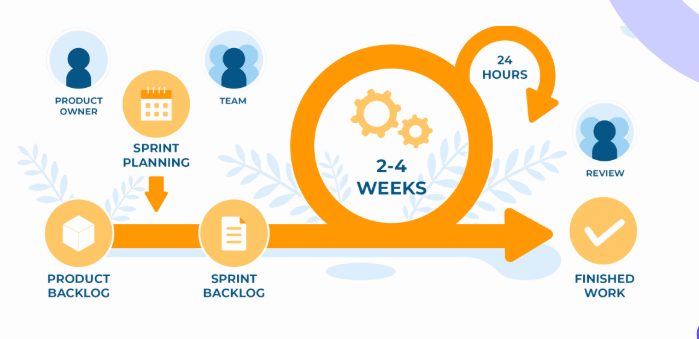
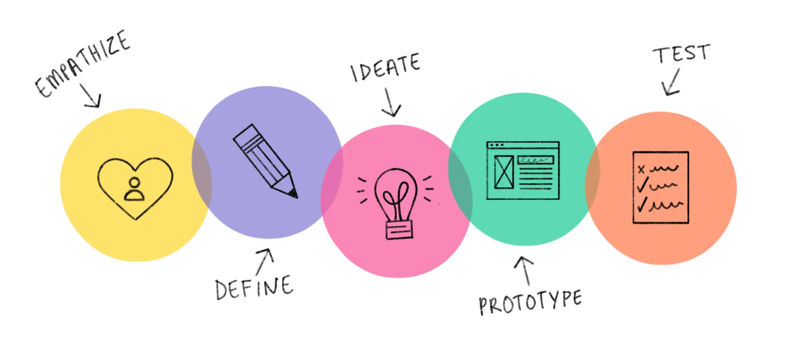
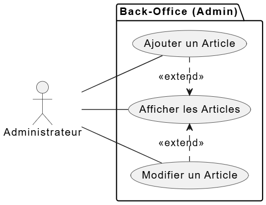
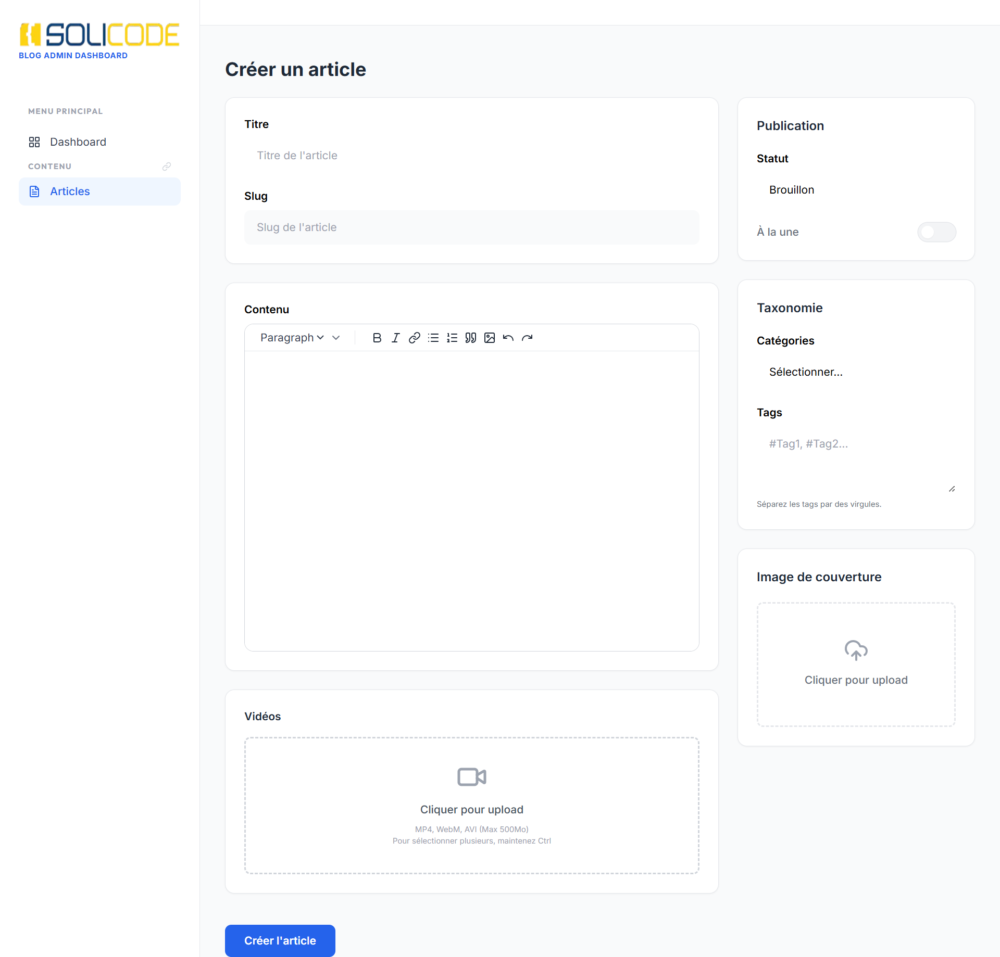
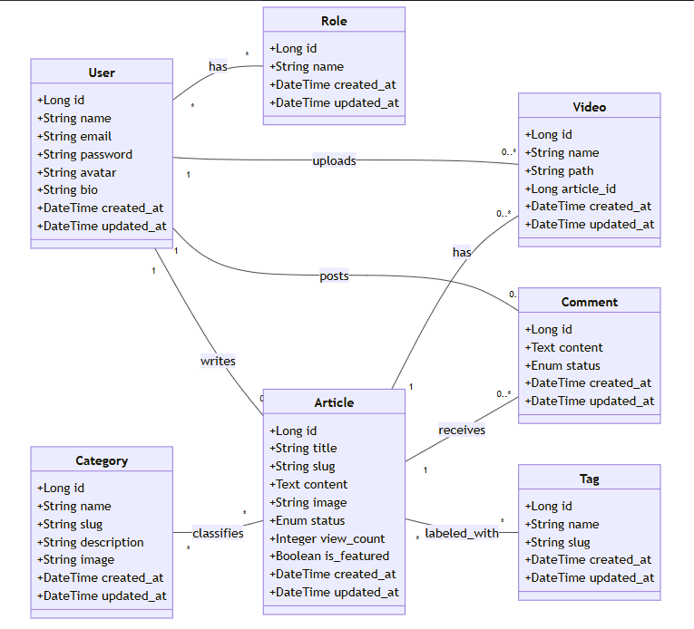

<!-- Page de garde -->
# Présentation Blog Solicode - Sprint 2
### Gestion des articles
**Présentée par : Salma Akajou**  
**Encadré par : M. ESSARRAJ FOUAD**

---

## Introduction

Dans le sprint précédent, on a déjà travaillé sur le **front office** du blog (page accueil, page articles, page détail article).  
Dans ce **Sprint 2**, on a intégré le **back office/admin**, pour la **gestion des articles** : ajout, édition, upload d’images et vidéos.

---

## Travail à faire

- Développer le formulaire pour **ajouter et éditer les articles**  
- Permettre l’**upload de fichiers** (images et vidéos)  
- Mettre en place la **gestion des articles** côté admin  

---

## Méthodologie : Scrum

**J’ai travaillé par Scrum :**  
- Organisation du travail en sprints courts  
- Suivi régulier des tâches  
- Priorisation et révision à chaque sprint  

---

## Méthodologie : Design Thinking

**J’ai travaillé par Design Thinking :**  
- Conception centrée sur l’utilisateur  
- Prototypage de la maquette avant développement  
- Tests et ajustements de l’interface  

---

## Fonctionnalités principales

---

## Labs réalisés

**Lab  : Upload fichiers et médias (Images & Vidéos)**

- Gestion de l’upload dans Laravel  
- Stockage sécurisé et enregistrement des chemins dans la base de données
- Prévisualisation des fichiers dans l’interface admin  

---

## Maquette réalisée

---

## Diagramme de classe

---

## Technologies utilisées

**Frontend :**  
- Blade (Laravel)  
- Preline  
- Tailwind CSS  

**Backend :**  
- Laravel 12  
- PHP  
- Architecture globale : **N-tiers** et **MVC**

---

## Prochain Sprint

- Ajout de la section **commentaires**  
- Gestion des **utilisateurs**  
- Gestion des **catégories**
